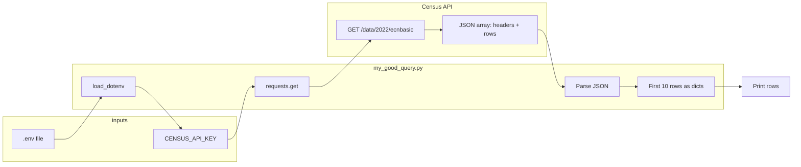
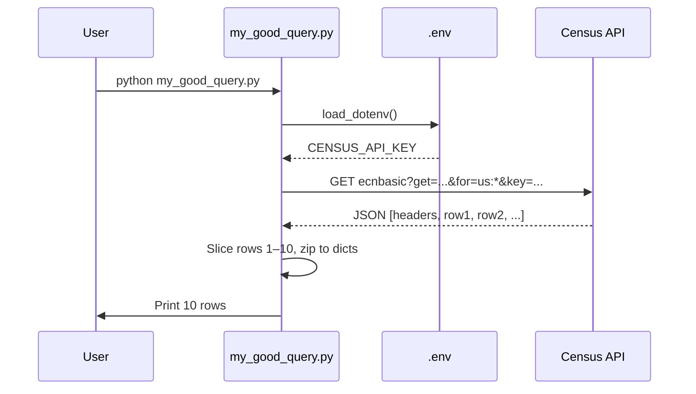

# Good API Query: Census ECN Basic

Documentation for `my_good_query.py` — a script that fetches U.S. Census Economic Census (ECN) basic statistics by NAICS industry for the nation.

---

## Overview

This script calls the **U.S. Census Bureau API** to retrieve economic data from the **2022 Economic Census (ecnbasic)**. It requests establishment counts, total receipts, and employment by NAICS industry code for the United States, then prints the first 10 rows as a list of dictionaries. The query is useful for reporting and analysis (e.g., industry-level economic snapshots).

**What it does:**

- Loads `CENSUS_API_KEY` from a `.env` file
- Requests variables: NAICS code, label, geography name, GEO_ID, establishments, total receipts, employment
- Scopes the request to the U.S. (`us:*`)
- Parses the JSON response and displays the first 10 rows as key–value records

---

## API Endpoint and Parameters

| Item | Value |
|------|--------|
| **Base URL** | `https://api.census.gov/data/2022/ecnbasic` |
| **Method** | GET |
| **Authentication** | Query parameter `key` (Census API key) |

### Query Parameters

| Parameter | Value | Description |
|-----------|--------|-------------|
| `get` | `NAICS2022,NAICS2022_LABEL,NAME,GEO_ID,ESTAB,RCPTOT,EMP` | Comma-separated list of variables to return |
| `for` | `us:*` | Geography: United States (all) |
| `key` | *(from .env)* | Your Census API key |

### Variable Definitions

| Variable | Description |
|----------|-------------|
| `NAICS2022` | NAICS 2022 industry code |
| `NAICS2022_LABEL` | Industry name/label |
| `NAME` | Geography name (e.g., "United States") |
| `GEO_ID` | Census geographic identifier |
| `ESTAB` | Number of establishments |
| `RCPTOT` | Total receipts (revenue) |
| `EMP` | Employment (paid employees) |

---

## Data Structure

The API returns a **JSON array**:

1. **First row** — header: variable names in the same order as requested in `get`.
2. **Remaining rows** — data rows; each row is an array of values aligned with the header.

The script:

1. Reads `data = response.json()`.
2. Sets `headers = data[0]` and `rows = data[1:11]` (first 10 data rows).
3. Builds `filtered` as a list of dictionaries: `[dict(zip(headers, row)) for row in rows]`.

**Example row (conceptual):**

```python
{
    "NAICS2022": "11",
    "NAICS2022_LABEL": "Agriculture, Forestry, Fishing and Hunting",
    "NAME": "United States",
    "GEO_ID": "0100000US",
    "ESTAB": "12345",
    "RCPTOT": "987654321",
    "EMP": "123456"
}
```

*(Values are strings in the API response.)*

---

## Flow Diagram (Mermaid)



**Sequence view (request → response):**



---

## Usage Instructions

### 1. Get a Census API key

- Go to [Census Bureau API Key Request](https://api.census.gov/data/key_signup.html).
- Submit the form and copy the key you receive (e.g., by email).

### 2. Create a `.env` file

In the same directory as `my_good_query.py` (or the project root, depending on where you run the script), create a file named `.env` with:

```bash
CENSUS_API_KEY=your_actual_key_here
```

Replace `your_actual_key_here` with your key. Do not commit `.env` to version control.

### 3. Install dependencies

```bash
pip install python-dotenv requests
```

### 4. Run the script

From the directory that contains `my_good_query.py` (and where Python can find `.env`):

```bash
python my_good_query.py
```

You should see:

- `Status code: 200`
- Then 10 lines of dictionary output, one per row (NAICS industry).

### 5. Troubleshooting

- **401 / Invalid key:** Check that `CENSUS_API_KEY` in `.env` is correct and has no extra spaces or quotes.
- **Missing .env:** Ensure `.env` exists in the working directory when you run the script (or adjust the path in the script if you keep `.env` elsewhere).
- **No module 'dotenv' / 'requests':** Run `pip install python-dotenv requests` in the same environment you use to run the script.

---

## Related

- Lab: `LAB_your_good_api_query.md`
- Census API: [api.census.gov](https://api.census.gov/data.html)
