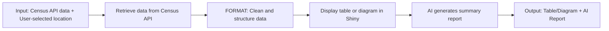

```mermaid
flowchart LR
A[Input: Census API data + User-selected location] --> B[Retrieve data from Census API]
B --> C[FORMAT: Clean and structure data]
C --> D[Display table or diagram in Shiny]
D --> E[AI generates summary report]
E --> F[Output: Table/Diagram + AI Report]

```
