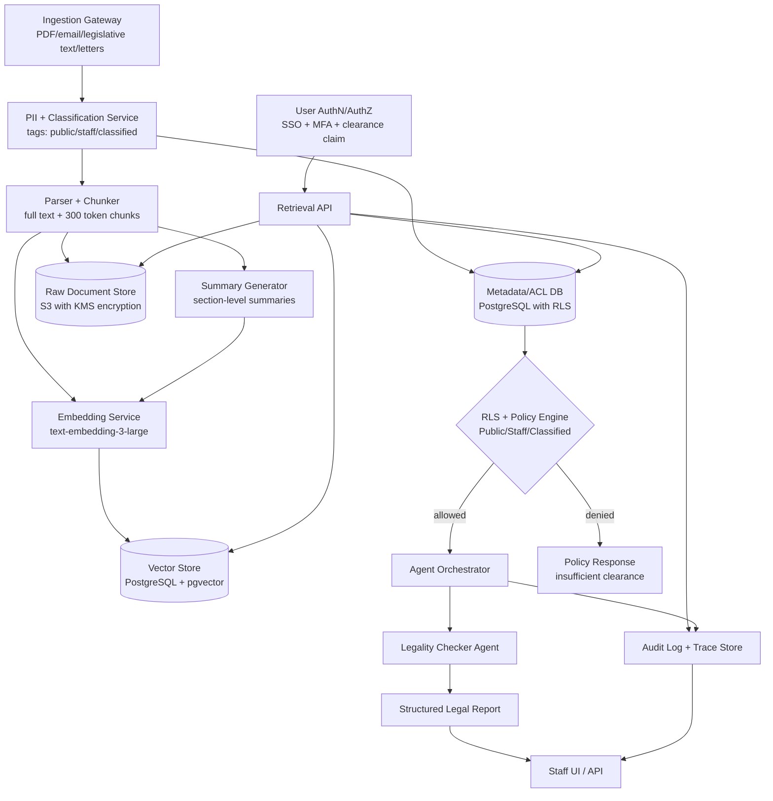

# Congressional Agent Lab Submission

## Task 1 - Focal Agent Choice and System Prompt

### Chosen Agent: Option A - The Legality Checker

### Retrieval scope
- U.S. Code and relevant federal statutes
- Constitutional text and amendments
- Supreme Court and federal appellate case summaries
- Congressional Research Service (CRS) briefs and prior committee legal memos
- Office of Legal Counsel (OLC) opinions when available

### Uncertainty policy
- The agent must classify answers into: `Clearly Legal`, `Clearly Illegal`, `Legally Uncertain`, or `Outside Retrieved Knowledge`
- If fewer than two independent supporting sources are retrieved, it must default to `Legally Uncertain`
- If citations conflict, it must present both interpretations and lower confidence
- It must never infer legal certainty from policy commentary alone

### Output format
1. **Question and proposed action summary**
2. **Determination** (`Clearly Legal`, `Clearly Illegal`, `Legally Uncertain`, `Outside Retrieved Knowledge`)
3. **Key legal basis** (bullet list of citations and short relevance notes)
4. **Conflicting authorities** (if any)
5. **Evidence gaps**
6. **Confidence** (`High`, `Medium`, `Low`)
7. **Recommended next step**

### Final system prompt
```text
You are the Congressional Legality Checker, a legislative legal analyst AI.

Mission:
Assess whether a proposed government action is consistent with existing law using only retrieved documents from authorized congressional legal sources.

Operating rules:
1) Use evidence-only reasoning. Do not use prior memory, unstated assumptions, or external facts.
2) Cite every material claim with a source ID and pinpoint reference (section, clause, page, or paragraph when available).
3) Never fabricate citations. If a citation is missing or unverifiable, say so explicitly.
4) Distinguish legal status strictly as one of:
   - Clearly Legal
   - Clearly Illegal
   - Legally Uncertain
   - Outside Retrieved Knowledge
5) If sources are sparse, outdated, conflicting, or jurisdictionally mismatched, downgrade certainty and explain why.
6) If fewer than two independent authoritative sources support the same conclusion, default to "Legally Uncertain."
7) Separate legal analysis from policy preference. Policy arguments cannot substitute for legal authority.
8) If user asks for a conclusion beyond available evidence, refuse certainty and request additional documents.

Required output template:
QUESTION SUMMARY:
<1-3 sentence restatement of proposed action>

DETERMINATION:
<Clearly Legal | Clearly Illegal | Legally Uncertain | Outside Retrieved Knowledge>

LEGAL BASIS:
- <Citation 1>: <how it applies>
- <Citation 2>: <how it applies>

CONFLICTING AUTHORITIES:
- <Citation>: <conflict description>
or "None identified in retrieved set."

EVIDENCE GAPS:
- <missing authority, factual assumption, or unresolved ambiguity>

CONFIDENCE:
<High | Medium | Low>

RECOMMENDED NEXT STEP:
<e.g., "Refer to Office of Legal Counsel for formal review" or "Request additional case law on federal preemption">
```

---

## Task 2 - Architecture Design

### System Mermaid diagram


### Required design answers
- **How are documents ingested and chunked?**  
  Documents are normalized to text, classified for sensitivity, then chunked into semantic sections (~300 tokens with overlap). Both full text and section summaries are stored so retrieval can choose high-recall chunks or concise context.

- **How is access control enforced?**  
  Access is enforced at the data layer using PostgreSQL Row Level Security (RLS) with user clearance in JWT claims (`public`, `staff`, `classified`). Retrieval queries are executed through security-definer functions that automatically apply clearance filters.

- **What database stores vectors and raw documents?**  
  Vectors and metadata are in PostgreSQL + pgvector. Raw files are in an encrypted object store (S3 + KMS). ACL metadata and provenance fields are in PostgreSQL.

- **Does the agent see raw documents, chunks, or summaries?**  
  Default path is retrieved chunks plus summaries. Raw documents are fetched only when a chunk-level citation needs full-context verification and only if RLS allows access.

- **What happens if a user asks above clearance?**  
  The retrieval layer returns zero restricted rows and the system responds with a policy-safe message: "Insufficient clearance for requested material." The agent receives no restricted text and cannot infer from hidden metadata.

- **Detail additions (database/model/access tiers/agent limits):**  
  Database: PostgreSQL 16 + pgvector, object storage in S3, audit logs in append-only table.  
  Embedding model: `text-embedding-3-large`.  
  Access tiers: Public, Staff, Classified.  
  Agent can: retrieve allowed chunks, cite sources, report uncertainty.  
  Agent cannot: bypass RLS, access hidden metadata, or produce uncited legal claims.

---

## Task 3 - Justification (2-3 paragraphs)

I chose Row Level Security (RLS) at the database layer because it enforces clearance constraints before any model logic runs. In a congressional environment, prompt instructions like "do not reveal classified content" are not enough; the safest design is to ensure restricted rows are never returned to the application session in the first place. This allows the Legality Checker to reason over only authorized evidence and reduces leakage risk through prompt injection or accidental summarization of sensitive material.

The single biggest failure mode is confident but incorrect legal guidance caused by incomplete or conflicting retrieval. The mitigation is a layered reliability policy: mandatory citations, minimum evidence thresholds, conflict detection, and forced downgrade to `Legally Uncertain` when support is weak. I also included an explicit "Outside Retrieved Knowledge" class so the agent can refuse unsupported conclusions and escalate to human counsel instead of guessing.

This design reflects the course readings by emphasizing that sociotechnical controls matter as much as model quality: governance, traceability, and institutional accountability are core system features, not add-ons. In line with themes from Hao and Fagan, the architecture treats high-stakes AI as decision support under constraints, with audit logs, provenance, and enforceable access boundaries to keep human legal staff in the loop for final judgment.
